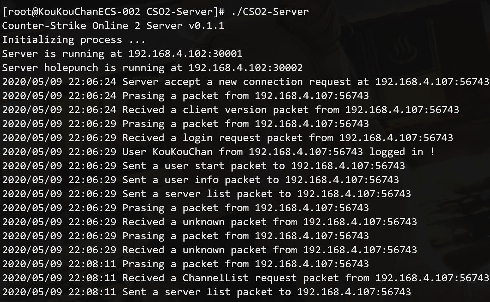
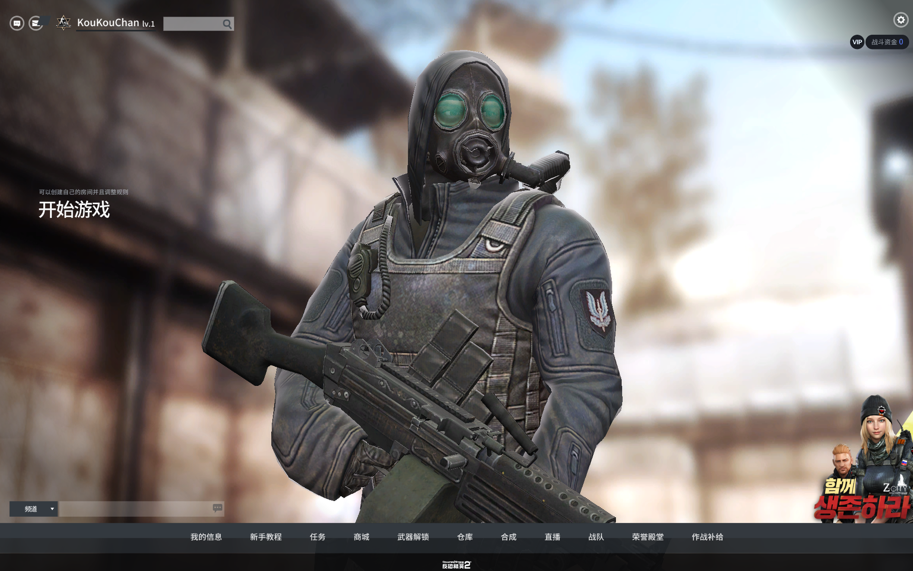
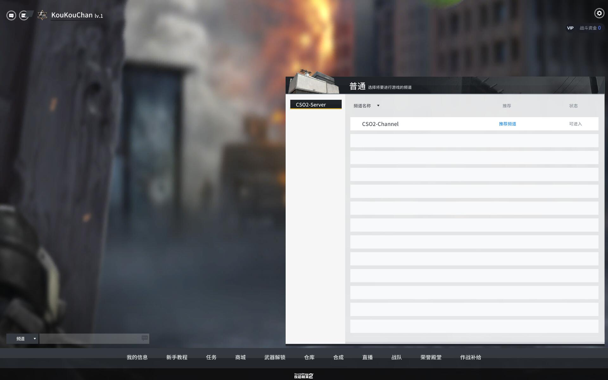
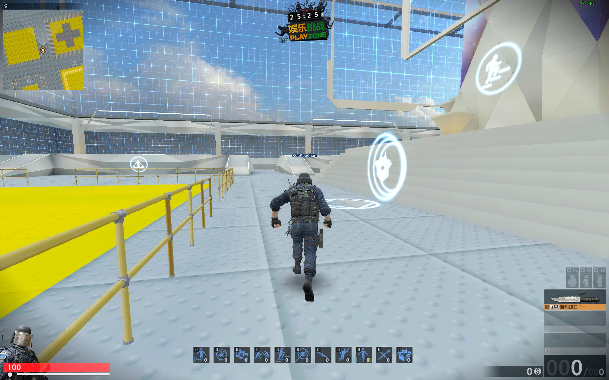
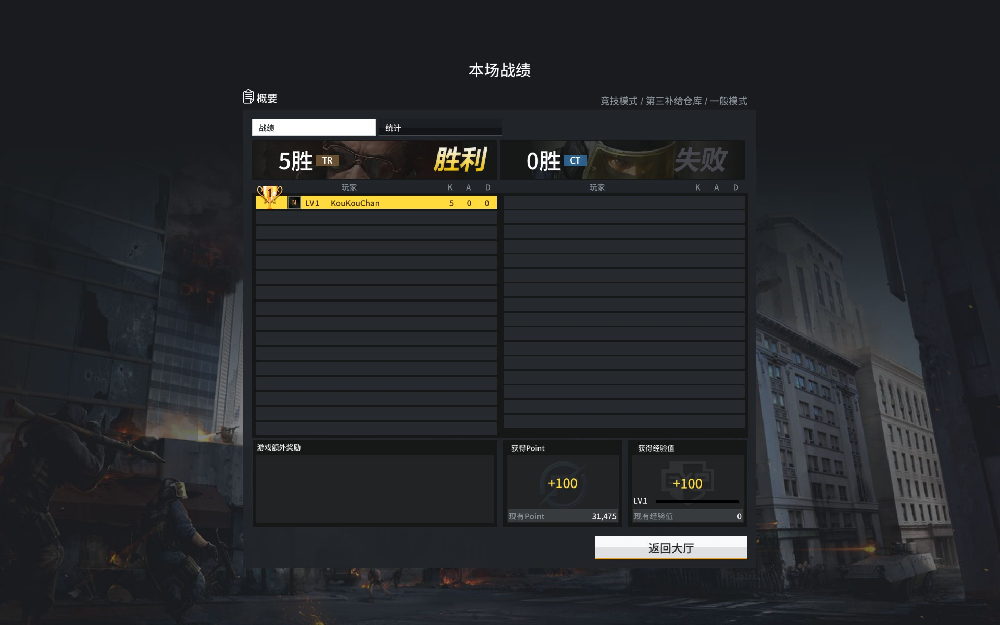

## Counter-Strike Online 2 Server 

[](https://ci.appveyor.com/project/KouKouChan/cso2-server)
[](./LICENSE)
[](https://github.com/NightElff/CSO2-Server/releases)

[English](./README.en.md) | [Turkish](./README.tr.md) | [CodePage](./CodePage.md)

*声明：Counter-Strike Online 2 归 NEXON 所有 ，本程序仅用于学习之用*


#### 20221204 notes:

​	这个项目太旧了，不管是代码风格还是架构等方面，且早期历史原因部分数据包与客户端并未对齐，改动的话牵一发而动全身，无法满足拓展需求，因此后续大概将不再维护该项目。我本地电脑有使用更好架构重写的代码，数据格式对齐更精确，因为个人精力时间等原因，并未写完，什么时候更新上来，我无法保证。


### 一、介绍

CSOL2 服务器 v0.1.0

默认需要浏览器打开**localhost:1314**网页注册账号，不需要输入邮箱和验证码

用于 **2017年国服 Counter-Strike Online 2** 和 **2018年韩服 Counter-Strike Online 2**  

目前客户端请使用L-Leite的启动器,**韩服端竞技模式有问题的请下载最新的汉化包**。

基于L-Leite的[cso2-master-server](https://github.com/L-Leite/cso2-master-server)。

如果大家有什么建议或问题，欢迎提出。

欢迎大家帮忙本地化文件，具体见下方第五部分。


### 二、基本已完成的功能

    登录、频道、房间、仓库、UDP、角色战绩(游戏结果界面)、数据库、个人信息、聊天、命令行和数据库、新手教程、开箱子

### 三、正在编写的功能

```
nop
```

### 四、已知问题

    nop

### 五、部分数据本地化方法

```
1.打开server.conf
2.修改LocaleFile选项，将其改为你的语种的文件名，比如 zh-tw.ini
3.进入 CSO2-Server\locales\ 目录
4.创建相同文件名文件，比如 zh-tw.ini
5.根据 zh-cn.ini 中的内容相应修改你的zh-tw.ini文件
```

### 六、客户端下载

  [点击2018年国服端下载](https://pan.baidu.com/s/1KD5ZIEsdTogUJ4WY_b-OjA) 提取码：52p7 

  [启动器下载](https://pan.baidu.com/s/1QGyRmjw24eJ5ycrFjorv_g)  提取码：amys

### 七、使用方法

1.需要有CSOL2客户端，同时使用第三方启动器

2.进入本项目的release页面下载最新版本的程序（ https://github.com/6276835/CSO2-Server/releases ）

3 .(国服端请跳过该步骤) 建立bat文件，和游戏的bin目录同级，里面写入：

```shell
START ./bin/launcher.exe -masterip IP地址 -enablecustom -username 用户名 -password 密码
```

4.IP地址指的是你的服务端IP，如果是本地那么就填127.0.0.1（仅单人情况下），如果你要连接局域网别人的服务端那么就填别人的IP地址，如果你安装了汉化包，也可以再加上以下语句：

```shell
-lang schinese
```

5.先运行本项目的exe文件启动服务器，然后打开bat文件启动客户端即可**（国服端可能启动稍慢）**

- 密码最好使用数字+字母形式，不然可能闪退！
- 从网盘里面下载得到的start-cso2.bat文件需要修改里面的IP地址和用户名！
- 默认情况下，你可以使用浏览器打开 localhost:1314 ，点击右上角register来注册，且不需要输入邮箱和验证码。
- 如果你想开启邮箱注册，那么你需要一个邮箱账号并且申请到了密钥，将密钥填入配置文件，同时开启EnableMail。
- 如果你是和别人联机玩，那么即使你的电脑运行着服务端也**不能**在bat文件里填127.0.0.1，不然对方无法通过你的ip连接你。
- 浏览器里可以输入localhost:1314进入web页面，点击右上角register进行注册。

### 八、Console使用方法

CSO2-Server自带管理员功能，可通过命令行参数打开console功能管理服务器，前提需要服务器已经在运行。

1.运行服务器。

2.使用local-console.bat连接本地服务器或者使用如下命令连接服务器：

```
CSO2-Server.exe -console -ip YOURIP -port YOURPORT -username GMNAME -password PASSWORD
```

默认参数如下:

```
Usage of CSO2-Server.exe:
  -ip string
        主机名，默认为localhost (default "localhost")
  -password string
        密码，默认为cso2server123 (default "cso2server123")
  -port string
        端口号，默认为1315 (default "1315")
  -username string
        账号，默认为admin (default "admin")
```

3.连接成功后可以使用命令管理服务器了，你可以踢出玩家，或者给予玩家物品等。

### 九、自定义文件方法

1.下载CSOL2解包工具，[点击这里下载](https://pan.baidu.com/s/14q1SoIdHwp1casMWG2OS-w) 提取码：41bs

2.解压后，打开工具，点击左上角File选项，点击Open folder，选中csol2的data文件夹即可

3.解压你需要的文件，并且将解压后的文件按你的想法进行修改

4.将文件放入csol2目录的custom文件夹下，打开游戏

### 十、Docker下使用方法

1.首先你需要拥有Docker,请下载并安装Docker,同时配置好Docker,比如Docker源

2.输入以下命令拉取最新版的服务端:

```shell
docker pull koukouchan/cso2-server:latest
```

3.运行服务端

```shell
docker run -p 30001:30001 -p 30002:30002 -p 1314:1314 -p 1315:1315 koukouchan/cso2-server:latest
```

4.接下来打开客户端，连接服务器

### 十一、编译环境

*Go 1.15.6*

当你要架设局域网或外网时，请打开防火墙的端口。30001-TCP类型端口、30002-UDP类型端口

貌似建立互联网服务器需要双方玩家都能内网穿透，实测局域网能够连接，互联网无法房间内加入主机，可能需要架设虚拟局域网。

### 十二、编译方法

```shell
1. 在shell中执行 go get github.com/6276835/CSO2-Server
2. 进入目录
3. 执行命令 go build
4. 运行生成的可执行文件即可
```

### 十三、Docker下编译方法

1.首先你需要拥有Docker,请下载并安装Docker和Git,同时配置好Docker,比如Docker源,使用如下命令安装git:

```
yum install git     #centos
或
apt-get install git #ubuntu
```

2.在终端下输入以下命令:

```shell
git clone https://github.com/6276835/CSO2-Server
cd CSO2-Server
docker build -t cso2-server .
```

3.在第2步后，如果运行正常，会显示所有步骤都运行完毕。接下来是运行服务端，为了能够让游戏和Docker容器里面的服务端相连，你需要打开相应的端口映射，使用以下命令运行：

```shell
docker run -p 30001:30001 -p 30002:30002 -p 1314:1314 -p 1315:1315 cso2-server
```

4.接下来打开客户端，连接服务器

5.建议关闭docker时将容器数据导出，否则将丢失玩家数据！

### 十四、图片










